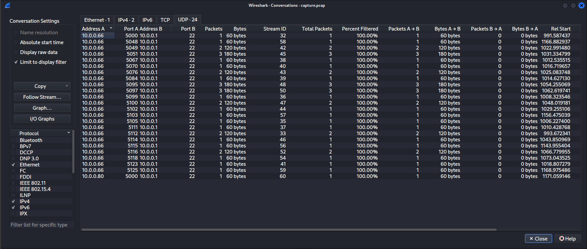
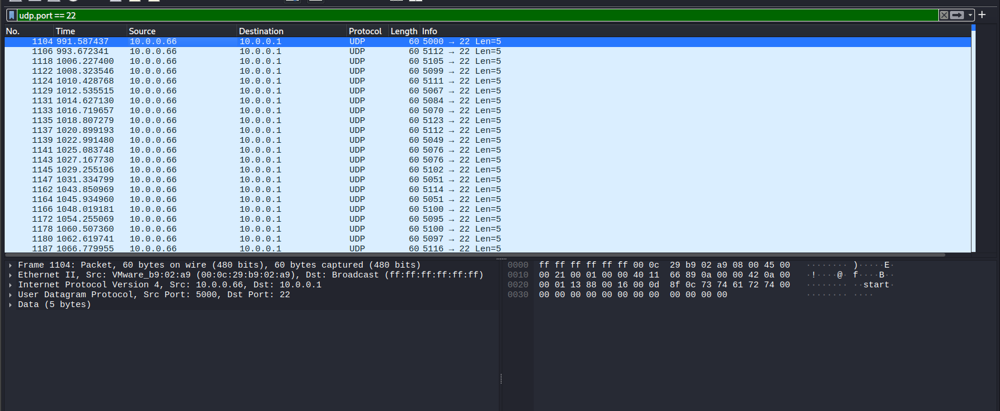
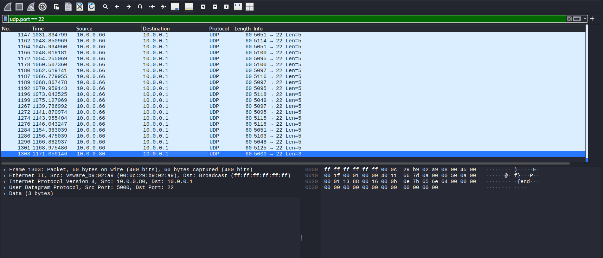

# Bài toán
- Description
    - We found this packet capture. Recover the flag.

# Giải
- Y như bài shark on wire thì tôi cũng follow stream của udp và thấy ico... và ghép lại giữa các stream thì được: picoCTF{StaT31355e_36} -> Nộp thì lại sai
- Ta dùng bảng Conversations (Statistics->Conversations) chuyển sang tab UDP thấy port 22 nhận lượng traffic áp đảo



- Filter udp.port == 22
- Quan sát danh sách gói tin thu được, ta thấy gói tin đầu tiên có nội dung data là "start" và gói cuối cùng là "end". Các gói tin ở giữa đều có độ dài bằng nhau nhưng data thô sơ, vô nghĩa.




- Chuyển hướng điều tra lên UDP Header. Ta nhận thấy trường Source Port (Cổng nguồn) của các gói tin này thay đổi liên tục, đều bắt đầu bằng số 5 và theo sau là 3 chữ số (ví dụ: 5112, 5105, 5099...).Nhận định 3 chữ số phía sau chính là mã ASCII của các ký tự cấu thành nên Flag
- Ta thấy 3 số cuối là 112 (ASCII của chữ p); 105 là i; 99 là c,...tương tự vậy 
- Bash:
```
┌──(kali㉿kali)-[/mnt/hgfs/picoCTF-writeups/Forensics/shark on wire 2]
└─$ tshark -r capture.pcap -Y "udp.port == 22" -T fields -e udp.srcport | awk '{print $1 - 5000}' | awk 'NR>1 {printf "%c", last} {last=$0} END {}'
picoCTF{flag}            
```
# Note
### 1. Kỹ thuật ẩn giấu: Covert Channel qua Lớp Transport (Header Covert Channel)

* **Bản chất:** Thay vì giấu thông tin mật vào vùng dữ liệu (Data Payload) vốn là nơi dễ bị các hệ thống kiểm duyệt (IDS/Deep Packet Inspection) soi dấu vết, kẻ tấn công tinh vi sẽ giấu dữ liệu vào các trường thông tin điều khiển của giao thức mạng (Headers) như IP Header, TCP Header, hoặc UDP Header. Kỹ thuật này còn gọi là **Network Steganography** (Giấu tin trong lưu lượng mạng).
* **Cách thức hoạt động:** Trường **Source Port** trong UDP có độ dài 16-bit (giá trị từ 0 đến 65535). Kẻ tấn công đã lập trình một script để gửi các gói tin UDP rác từ các cổng nguồn được tính toán từ trước: $Source Port = 5000 + ASCII\_Code$. Khi gói tin đi qua mạng, các thiết bị định tuyến chỉ nhìn thấy đây là các kết nối UDP thông thường, nhưng máy nhận (hoặc người làm Forensics) biết quy luật sẽ trừ đi số 5000 để lấy ra thông điệp gốc.

### 2. Dấu hiệu nghi vấn để phát hiện bài toán (Forensics Mindset)

* **Sự lệch pha của Giao thức & Cổng (Protocol/Port Mismatch):** Cổng `22` là cổng tiêu chuẩn của dịch vụ bảo mật SSH, vốn bắt buộc phải chạy trên giao thức tin cậy là **TCP** để quản lý phiên. Khi bạn thấy xuất hiện hàng loạt gói tin **UDP** nã vào Port 22, đó là dấu hiệu bất thường 100% (Anomally), chứng tỏ Port này đang bị lợi dụng làm kênh giao tiếp ngầm (Covert Channel).
* **Gói tin báo hiệu (Signaling Packets):** Sự xuất hiện của gói tin chứa chữ `"start"` và `"end"` ở đầu và cuối luồng chính là cơ chế "giao tiếp" của mã độc, báo hiệu cho máy nhận biết khi nào luồng dữ liệu bắt đầu truyền và khi nào kết thúc để tiến hành ráp nối dữ liệu.

### 3. Kinh nghiệm thực chiến khi làm bài

* **Tầm quan trọng của việc sắp xếp (Packet Ordering):** Trong môi trường mạng hoặc khi lưu file pcap, các gói tin UDP (vốn không có số thứ tự Sequence Number như TCP) rất dễ bị hiển thị xáo trộn không theo trình tự thời gian gửi. Luôn nhớ click vào cột **No.** hoặc sắp xếp theo cột **Time** trước khi trích xuất dữ liệu, tránh trường hợp decode ra đúng ký tự nhưng bị đảo lộn vị trí tạo ra flag lỗi.
* **Tự động hóa bằng Script (Python Scapy):** Khi số lượng gói tin quá lớn, việc chép tay từng số Port rất mất thời gian. Bạn có thể dùng script Python ngắn để cào tự động:
```python
import scapy.all as scapy
packets = scapy.rdpcap('capture.pcap')
flag = ""
for pkt in packets:
    if pkt.haslayer(scapy.UDP) and pkt[scapy.UDP].dport == 22:
        sport = pkt[scapy.UDP].sport
        if sport != 5000: # Bỏ qua gói start/end nếu có port đặc biệt hoặc xử lý điều kiện
            flag += chr(sport - 5000)

```